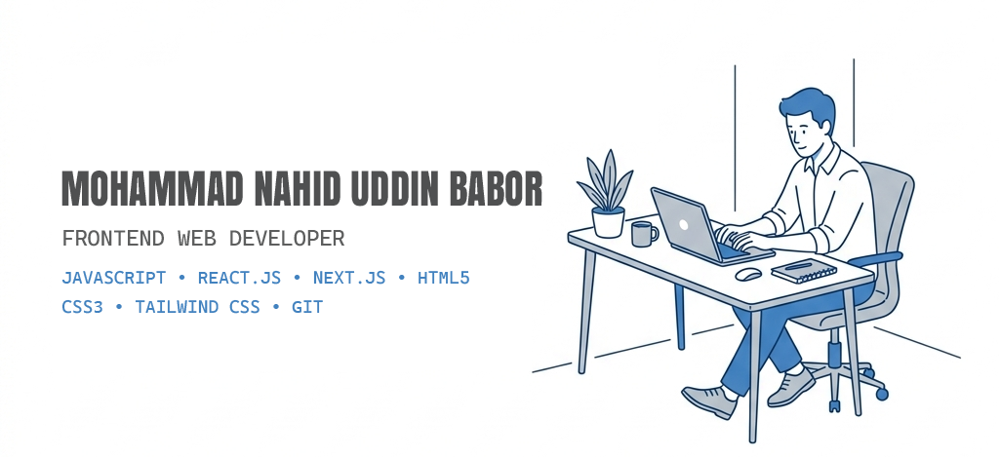

  

  

  <b>Aspiring Frontend Developer 🚀 | Passionate about building modern, responsive, and performance-oriented web applications using React, Next.js, and JavaScript.</b>

  
  
  
  

<table>
  <tr>
    <td width="60%">
      <h3>Talking about Personal Stuff:</h3>
      <ul>
        <li>🛠️ I’m currently working with <b>JavaScript, TypeScript, React, and Tailwind CSS</b>.</li>
        <li>🚀 I’m currently exploring <b>Next.js and Backend fundamentals</b>.</li>
        <li>📫 Reach me out: <a href="mailto:[EMAIL_ADDRESS]">[mdsnbabor828@gmail.com]</a></li>
      </ul>
      <h3>My Absolute Favorites:</h3>
      <ul>
        <li>💻 Crafting interactive, high-performance web apps with React.</li>
        <li>✨ Bringing creative designs to life with Tailwind CSS.</li>
        <li>🚀 Exploring scalable Next.js architectures & backend integrations.</li>
      </ul>
    </td>
    <td width="40%" align="center">
      
    </td>
  </tr>
</table>

### 🛠️ Tech Universe

  <table>
    <tr>
      <td align="center" width="96">
        
         JS
      </td>
      <td align="center" width="96">
        
         React
      </td>
      <td align="center" width="96">
        
         Next.js
      </td>
      <td align="center" width="96">
        
         Tailwind
      </td>
      <td align="center" width="96">
        
         HTML
      </td>
      <td align="center" width="96">
        
         CSS
      </td>
    </tr>
    <tr>
      <td align="center" width="96">
        
         Node.js
      </td>
      <td align="center" width="96">
        
         MySql
      </td>
      <td align="center" width="96">
        
         Git
      </td>
      <td align="center" width="96">
        
         Figma
      </td>
      <td align="center" width="96">
        
         PS
      </td>
      <td align="center" width="96">
        
         AI
      </td>
    </tr>
  </table>

  

