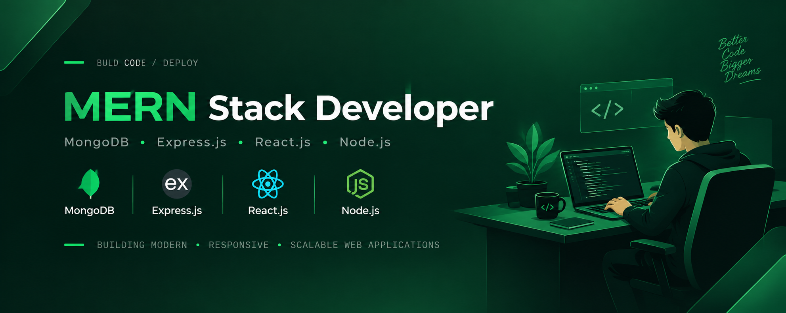

<p align="left">
  
</p>

<p align="center">
  
</p>

<hr />

<h2 align="center">👋 Hi, I'm <strong>Mohammad Nahid Uddin Babor</strong></h2>

<p align="center">
  <em>
    Frontend Developer crafting modern, scalable &amp; high-performance web experiences<br/>
    with <strong>MongoDB</strong>, <strong>Express.js</strong>, <strong>React.js</strong>, <strong>Next.js</strong>, &amp; <strong>Tailwind CSS</strong>
  </em>
</p>

<p align="center">
  <a href="https://linkedin.com/in/mohammad-nahid-uddin-babor">
    
  </a>
  &nbsp;
  <a href="https://yourwebsite.com">
    
  </a>
  &nbsp;
  <a href="https://twitter.com/yourhandle">
    
  </a>
  &nbsp;
  <a href="mailto:mdsnbabor828@gmail.com">
    
  </a>
</p>

<hr />

## 🧑‍💻 About Me

<div align="center" width="100%">

```bash
╔═════════════════════════════════════════════════════════════════════════════════════╗
║                          babor@dev ~ $ whoami                                       ║
╚═════════════════════════════════════════════════════════════════════════════════════╝

   Name       :  Mohammad Nahid Uddin Babor
   Role       :  Frontend Developer  →  Aspiring Full-Stack Developer
   Location   :  Bangladesh 🇧🇩
   Email      :  mdsnbabor828@gmail.com

╔═════════════════════════════════════════════════════════════════════════════════════╗
║                        babor@dev ~ $ cat status.log                                 ║
╚═════════════════════════════════════════════════════════════════════════════════════╝

   🔭  Building    →  JavaScript, TypeScript, React & Tailwind CSS
   🌱  Learning    →  Backend fundamentals (Node.js, Express.js, MongoDB)
   🎯  Goal        →  Land a Full-Stack Developer role & contribute to impactful projects
   ✍️  Philosophy  →  Write clean, accessible & maintainable code
   🤝  Open to     →  Collaborations, Open Source & Freelance projects

╔═════════════════════════════════════════════════════════════════════════════════════╗
║                       babor@dev ~ $ cat favorites.sh                                ║
╚═════════════════════════════════════════════════════════════════════════════════════╝

   💻  React.js    →  Building interactive, high-performance web applications
   🎨  Tailwind    →  Crafting pixel-perfect, responsive UI/UX designs
   ⚡  Next.js     →  Scalable, SEO-friendly full-stack architectures
   🗄️  MongoDB     →  Flexible, document-based data modeling

   babor@dev ~ $ █
```

</div>

<hr />

## 🛠️ Tech Stack

<div align="center">

**⚙️ Frontend**

<p>
  
</p>

**🗄️ Backend &amp; Database**

<p>
  
</p>

**🧰 Tools &amp; Design**

<p>
  
</p>

</div>

<hr />

## 📊 GitHub Stats

<div align="center">
  
  &nbsp;
  
</div>

<br/>

<div align="center">
  
</div>

<br/>


<hr />

<p align="center">
  <em>⭐️ From <a href="https://github.com/mdsnbabor330">mdsnbabor330</a> — Let's connect and build something amazing together!</em>
</p>
